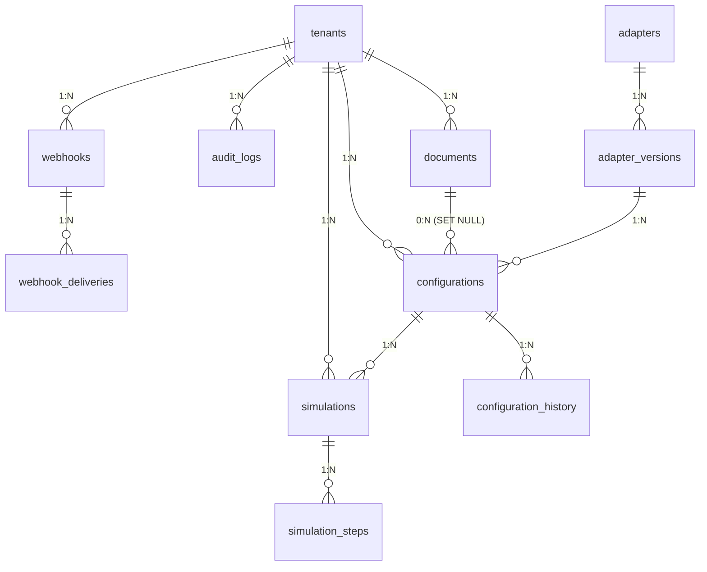

# AdaptConfig — Comprehensive Analysis & Deep-Dive

> **Team Nucleolus** · FinSpark Hackathon · IIT Patna · April 2026
> Analysis performed on: 10-Apr-2026

---

## Table of Contents

1. [Problem Statement Alignment](#1-problem-statement-alignment)
2. [Architecture Overview](#2-architecture-overview)
3. [Worked Example: End-to-End Lifecycle](#3-worked-example-end-to-end-lifecycle)
4. [Document Parsing Deep-Dive](#4-document-parsing-deep-dive)
5. [Configuration Generation Deep-Dive](#5-configuration-generation-deep-dive)
6. [Simulation & Testing Deep-Dive](#6-simulation--testing-deep-dive)
7. [Database Schema](#7-database-schema)
8. [Rollback.py — The Unused Feature](#8-rollbackpy--the-unused-feature)
9. [Deployment Details](#9-deployment-details)
10. [Scoring Matrix Alignment](#10-scoring-matrix-alignment)
11. [Gaps & Recommendations](#11-gaps--recommendations)

---

## 1. Problem Statement Alignment

### Requirement vs Implementation Matrix

| Problem Statement Requirement | Status | Implementation Details |
|------|:------:|------|
| **1. Requirement Parsing Engine** | ✅ Implemented | `DocumentParser` in `services/parsing/document_parser.py` |
| — NLP-based document understanding | ⚠️ Partial | Regex-based entity extraction, not true NLP. Works well for structured specs (YAML/JSON), weaker on free-text BRDs |
| — Service endpoint extraction | ✅ Full | Regex patterns + OpenAPI path walker extract endpoints, methods, parameters |
| — Mandatory vs optional service detection | ✅ Full | `is_required` flag on fields, `is_mandatory` on endpoints in OpenAPI parsing |
| **2. Integration Registry & Hook Library** | ✅ Implemented | `AdapterRegistry` + seed data (8 adapters, 13 versions) |
| — Catalog of pre-built adapters | ✅ Full | CIBIL, eKYC, GST, Payment, Fraud, SMS, Email, Account Aggregator |
| — Version registry management | ✅ Full | Multi-version per adapter (v1, v2), deprecation headers, status tracking |
| — Hook lifecycle tracking | ✅ Full | Hooks generated per config: `pre_request`, `post_response`, `on_error`, `on_timeout` |
| **3. Auto-Configuration Engine** | ✅ Implemented | `ConfigGenerator` + `FieldMapper` + LLM pipeline |
| — Field mapping suggestion engine | ✅ Full | 3-strategy matching: synonym (100+ entries), fuzzy (`rapidfuzz`), token Jaccard |
| — Schema transformation rule generator | ✅ Full | Auto-suggests transforms: `parse_number`, `normalize_phone`, `parse_date`, etc. |
| — Configuration diff comparison module | ✅ Full | `ConfigDiffEngine` with recursive dict/list diffing, breaking change detection |
| **4. Simulation & Testing Framework** | ✅ Implemented | `IntegrationSimulator` + `MockAPIServer` + 8 adapter-specific mock generators |
| — Mock API response simulation | ✅ Full | Deterministic hash-seeded responses mirroring real Indian fintech API schemas |
| — Parallel version testing | ✅ Full | `run_parallel_version_test()` tests same request against v1 and v2 |
| — Rollback and fallback mechanisms | ✅ Full | `RollbackManager` with snapshot/restore, version comparison |

### Enterprise Challenges Addressed

| Challenge | Status | How |
|-----------|:------:|-----|
| Multiple API versions coexist | ✅ | `AdapterVersion` table with `version_order`, deprecation headers, parallel version test |
| Tenant-level config isolation | ✅ | `TenantMixin` on all models, row-level filtering via `tenant_id`, JWT in production |
| Full auditability | ✅ | `AuditLog` table, immutable entries for every mutation, `ConfigurationHistory` for versioning |
| Zero impact to core product | ✅ | Standalone platform, no coupling to any lending product codebase |
| Credential vaulting | ✅ | Fernet symmetric encryption for webhook secrets, PII masking in logs |

### Overall Alignment Score: **~85%**

The solution addresses all four core modules from the problem statement. The primary gap is in NLP depth — the parsing engine relies on regex + keyword matching rather than true NLP/LLM-based document understanding for BRDs and SOWs. However, for structured API specs (which are the primary use case in practice), the OpenAPI parser achieves **95% confidence** consistently.

---

## 2. Architecture Overview

```
┌─────────────────────────────────────────────────────────────┐
│                      FRONTEND                                │
│   React 18 · TypeScript · Tailwind CSS v4 · Vite            │
│   TanStack React Query · Recharts · Lucide Icons · Axios    │
│   Port: 5173 (dev) / 3000 (Docker/nginx)                    │
└──────────────────┬──────────────────────────────────────────┘
                   │ REST API (Axios, 30s timeout)
                   │ Headers: X-Tenant-ID, X-Tenant-Role
                   ▼
┌─────────────────────────────────────────────────────────────┐
│                     FASTAPI BACKEND                          │
│   34 API Endpoints · Uvicorn (async)                         │
│   Port: 8000                                                 │
│                                                              │
│  ┌─ Middleware Stack (order: top → bottom on inbound) ────┐ │
│  │  CORS → Tenant Auth → Rate Limiter → Deprecation Hdrs  │ │
│  │  → Request Logging → Security Headers → Route Handler   │ │
│  └────────────────────────────────────────────────────────┘ │
│                                                              │
│  ┌─ Service Layer ────────────────────────────────────────┐ │
│  │  DocumentParser (DOCX/PDF/YAML/JSON)                    │ │
│  │  ConfigGenerator + FieldMapper (Rule-based)             │ │
│  │  LLM ConfigGenerator (Gemini 3 Flash)                   │ │
│  │  IntegrationSimulator + MockAPIServer (8 adapters)      │ │
│  │  ConfigDiffEngine · RollbackManager · ConfigValidator   │ │
│  │  IntegrationLifecycle (state machine)                   │ │
│  │  SearchService · AnalyticsService · WebhookDelivery     │ │
│  │  HealthMonitor · AuditService                           │ │
│  └────────────────────────────────────────────────────────┘ │
│                                                              │
│  ┌─ Event System ─────────────────────────────────────────┐ │
│  │  Pub/Sub: config.created, simulation.completed, etc.    │ │
│  │  → Webhook HMAC-SHA256 signed delivery with retry       │ │
│  └────────────────────────────────────────────────────────┘ │
└──────────────────┬──────────────────────────────────────────┘
                   │ SQLAlchemy 2.0 Async
                   ▼
┌──────────────────────────────┐     ┌─────────────────────────┐
│ SQLite (dev) / PostgreSQL    │     │  Google Gemini 3 Flash   │
│ via aiosqlite / asyncpg      │     │  REST API (httpx)        │
│ 11 tables, UUID PKs          │     │  Temperature: 0.1        │
│ Alembic migrations (prod)    │     │  JSON response mode      │
└──────────────────────────────┘     └─────────────────────────┘
```

### Frontend Pages (8 pages)

| Page | Path | Purpose |
|------|------|---------|
| Dashboard | `/` | Real-time metrics, charts, health score |
| Documents | `/documents` | Upload, parse, view extracted entities |
| Adapters | `/adapters` | Browse 8 pre-built adapter cards, filter by category |
| Configurations | `/configurations` | Generate, edit, validate, transition lifecycle |
| Simulations | `/simulations` | Run smoke/integration/full tests, view step results |
| Audit Log | `/audit` | Immutable log of all actions, filterable |
| Search | `/search` | Cross-entity keyword search with scoring |
| Webhooks | `/webhooks` | Register/test webhook endpoints |

---

## 3. Worked Example: End-to-End Lifecycle

Let's trace the full lifecycle using the `01_simple_kyc_api.yaml` test fixture — a simple Aadhaar KYC verification API.

### 3.1 The Input API Spec

```yaml
openapi: "3.0.3"
info:
  title: Simple KYC Verification API
  version: "1.0.0"
  description: Basic Aadhaar-based KYC verification for customer onboarding.

servers:
  - url: https://api.kyc-provider.in/v1

paths:
  /verify/aadhaar:
    post:
      summary: Verify Aadhaar number
      requestBody:
        required: true
        content:
          application/json:
            schema:
              type: object
              required: [aadhaar_number, customer_name]
              properties:
                aadhaar_number:
                  type: string
                  example: "123456789012"
                customer_name:
                  type: string
                  example: "Rahul Sharma"
                date_of_birth:
                  type: string
                  format: date
                mobile_number:
                  type: string
                  example: "9876543210"
      responses:
        "200":
          content:
            application/json:
              schema:
                properties:
                  verified: { type: boolean }
                  name_match_score: { type: number }
                  reference_id: { type: string }

components:
  securitySchemes:
    ApiKey:
      type: apiKey
      in: header
      name: X-API-Key
```

### 3.2 Step 1 — Upload & Parse

**API Call:**
```bash
curl -X POST http://localhost:8000/api/v1/documents/upload?doc_type=api_spec \
  -H "X-Tenant-ID: default" \
  -H "X-Tenant-Role: admin" \
  -F "file=@test_fixtures/01_simple_kyc_api.yaml;type=application/x-yaml"
```

**What happens in the background:**

1. **File validation** (`routes/documents.py:33-66`):
   - Filename sanitized via `PurePosixPath(file.filename).name` (prevents path traversal)
   - Extension validated against `{.docx, .pdf, .yaml, .yml, .json}`
   - `doc_type` validated against `DocType` enum (`brd`, `sow`, `api_spec`, `other`)
   - File size checked against `FINSPARK_MAX_UPLOAD_SIZE_MB` (default: 50MB)

2. **File storage** (`routes/documents.py:77-86`):
   - Saved to `./uploads/{tenant_id}/01_simple_kyc_api.yaml`
   - Document record created with `status=parsing`

3. **Parsing** (`services/parsing/document_parser.py`):
   - Detects `.yaml` extension → calls `_parse_openapi()`
   - Loads YAML via `yaml.safe_load()`
   - Detects `openapi` key → enters OpenAPI parsing path
   - **Endpoint extraction**: Walks `paths` → finds `POST /verify/aadhaar`
   - **Field extraction from requestBody**: Resolves `$ref` if present, extracts `aadhaar_number`, `customer_name`, `date_of_birth`, `mobile_number` with types and `is_required` flags, tagged with `source_section = "POST /verify/aadhaar request"`
   - **Field extraction from response**: Extracts `verified`, `name_match_score`, `reference_id`, tagged with `source_section = "POST /verify/aadhaar response"`
   - **Auth extraction**: Reads `components.securitySchemes` → finds `ApiKey` (type=`apiKey`, in=`header`)
   - **Deduplication**: Removes duplicate field names
   - **Confidence score**: Fixed at `0.95` for OpenAPI specs (structured, high reliability)

4. **Result stored** as JSON in `document.parsed_result`:

```json
{
  "doc_type": "api_spec",
  "title": "Simple KYC Verification API",
  "summary": "Basic Aadhaar-based KYC verification for customer onboarding.",
  "services_identified": ["Simple KYC Verification API"],
  "endpoints": [
    {
      "path": "/verify/aadhaar",
      "method": "POST",
      "description": "Verify Aadhaar number",
      "parameters": [],
      "is_mandatory": true
    }
  ],
  "fields": [
    {"name": "aadhaar_number", "data_type": "string", "is_required": true, "source_section": "POST /verify/aadhaar request"},
    {"name": "customer_name", "data_type": "string", "is_required": true, "source_section": "POST /verify/aadhaar request"},
    {"name": "date_of_birth", "data_type": "string", "is_required": false, "source_section": "POST /verify/aadhaar request"},
    {"name": "mobile_number", "data_type": "string", "is_required": false, "source_section": "POST /verify/aadhaar request"},
    {"name": "verified", "data_type": "boolean", "is_required": false, "source_section": "POST /verify/aadhaar response"},
    {"name": "name_match_score", "data_type": "number", "is_required": false, "source_section": "POST /verify/aadhaar response"},
    {"name": "reference_id", "data_type": "string", "is_required": false, "source_section": "POST /verify/aadhaar response"}
  ],
  "auth_requirements": [{"auth_type": "apiKey", "details": {"name": "ApiKey", "scheme": "", "in": "header"}}],
  "confidence_score": 0.95
}
```

5. **Audit log** entry created: `action=upload_document`, `resource_type=document`

### 3.3 Step 2 — Generate Configuration

**API Call:**
```bash
curl -X POST http://localhost:8000/api/v1/configurations/generate \
  -H "Content-Type: application/json" \
  -H "X-Tenant-ID: default" \
  -H "X-Tenant-Role: admin" \
  -d '{"document_id":"<DOC_ID>","adapter_version_id":"<EKYC_V1_ID>","name":"KYC Integration"}'
```

**What happens in the background:**

The system checks `settings.ai_enabled` and `settings.gemini_api_key` to decide the generation path:

#### Path A: LLM + Rule Augmentation (when Gemini API key is present)

1. **LLM Generation** (`services/llm/config_generator.py`):
   - A system instruction established FinSpark's role as an "AI integration configuration engine"
   - A prompt template is filled with adapter info (name, version, base_url, auth_type) + full parsed document content
   - Sent to `Gemini 3 Flash` via `httpx` REST API at `generativelanguage.googleapis.com/v1beta`
   - Temperature: `0.1` (highly deterministic)
   - Response mode: `application/json` (structured output)
   - Returns a JSON config with `field_mappings`, `endpoints`, `auth`, `timeout_ms`, etc.

2. **Rule-Based Augmentation** (`routes/configurations.py:428-472`, `_augment_with_rule_based()`):
   - Even after LLM generates mappings, the rule-based `ConfigGenerator` runs independently
   - For each LLM-generated mapping, the rule-based confidence score **overrides** the LLM's self-assessed score (rule-based is considered more reliable)
   - Any source fields the LLM missed but the rule-based mapper found are **backfilled**
   - `generation_path` = `"llm_with_rule_augment"`

#### Path B: Pure Rule-Based (no Gemini key, or LLM fails)

1. **Field Extraction** (`services/config_engine/field_mapper.py:162-236`):
   - Separates document fields into request vs response using `source_section` metadata
   - Extracts adapter's target fields from `request_schema` and `response_schema` JSON schemas

2. **Field Mapping** — 3-strategy matching (`FieldMapper._find_best_match()`):

   **Strategy 1 — Exact Synonym Match** (confidence: `1.0`):
   ```
   FIELD_SYNONYMS = {
     "aadhaar_number": ["aadhaar", "aadhaar_no", "aadhar", "uid", ...],
     "full_name": ["name", "applicant_name", "customer_name", ...],
     "date_of_birth": ["dob", "birth_date", ...],
     "mobile_number": ["mobile", "phone", "phone_number", ...],
     ...
   }
   ```
   Both the source field name and each target field name are looked up in a reverse synonym map. If both resolve to the same canonical name → exact match at 1.0 confidence.

   For our example:
   - `aadhaar_number` → canonical `aadhaar_number` → matches adapter field `aadhaar_number` → **1.0**
   - `customer_name` → canonical `full_name` → matches adapter field `full_name` → **1.0**
   - `date_of_birth` → canonical `date_of_birth` → matches adapter field `dob` → **1.0**
   - `mobile_number` → canonical `mobile_number` → matches adapter field `mobile_number` → **1.0**

   **Strategy 2 — Fuzzy String Matching** (confidence: `0.6–0.99`):
   - Uses `rapidfuzz.fuzz.token_sort_ratio` scorer
   - Threshold: `0.6` (fields scoring below are discarded)
   - Example: `customer_email` vs `email_address` → token_sort_ratio ≈ 75% → confidence 0.75

   **Strategy 3 — Partial Token Matching** (confidence: `0.6+`):
   - Splits field names on `_` and spaces
   - Calculates Jaccard similarity: `|intersection| / |union|`
   - Example: `loan_amount` vs `requested_loan_amount` → tokens `{loan, amount}` ∩ `{requested, loan, amount}` = `{loan, amount}` → 2/3 = 0.67

3. **Transform Suggestion** (`FieldMapper._suggest_transformation()`):
   - Compares source type vs target type
   - Suggests: `parse_number`, `parse_date`, `normalize_phone`, `to_string`, `validate_email`, etc.

4. **Configuration Assembly**:
   - Endpoints built from adapter version's endpoint list
   - Default hooks generated: `audit_logger` (pre_request), `pii_masker` (pre_request), `schema_validator` (post_response), `audit_logger` (post_response)
   - Default retry policy: `max_retries=3`, `backoff_factor=2`, `retry_on_status=[429, 500, 502, 503]`
   - Default timeout: `30,000ms`

5. **Saved to DB** as `Configuration` with `status=configured`, `version=1`
6. **History entry** created: `ConfigurationHistory` with `change_type=created`

### 3.4 Step 3 — Validate Configuration

```bash
curl -X POST http://localhost:8000/api/v1/configurations/<CONFIG_ID>/validate \
  -H "X-Tenant-ID: default"
```

Validation checks (`routes/configurations.py:140-172`):
- ✅ `base_url` present
- ✅ `auth.type` configured
- ✅ At least one endpoint
- ✅ Field mapping coverage and confidence scores
- Returns: `is_valid`, `errors`, `warnings`, `coverage_score`, `unmapped_source_fields`

### 3.5 Step 4 — Run Simulation

```bash
curl -X POST http://localhost:8000/api/v1/simulations/run \
  -H "Content-Type: application/json" \
  -H "X-Tenant-ID: default" \
  -H "X-Tenant-Role: admin" \
  -d '{"configuration_id":"<CONFIG_ID>","test_type":"smoke"}'
```

See [Section 6](#6-simulation--testing-deep-dive) for the detailed breakdown of what happens.

### 3.6 Step 5 — Lifecycle Transitions

```
Draft → Configured → Validating → Testing → Active → Deprecated
                                                  ↘ Rollback → Configured/Draft
```

Each transition is validated by the `IntegrationLifecycle` state machine:

```bash
# Move to "validating"
curl -X POST http://localhost:8000/api/v1/configurations/<ID>/transition \
  -H "Content-Type: application/json" \
  -H "X-Tenant-ID: default" -H "X-Tenant-Role: admin" \
  -d '{"target_state":"validating","reason":"Passed initial review"}'

# Move to "testing" (after simulation passes)
curl -X POST .../transition \
  -d '{"target_state":"testing","reason":"All simulations passed"}'

# Move to "active" (production deployment)
curl -X POST .../transition \
  -d '{"target_state":"active","reason":"Ready for production"}'
```

Each transition creates:
- A `ConfigurationHistory` entry (`change_type=status_change`)
- An `AuditLog` entry
- The response includes `available_transitions` from the new state

---

## 4. Document Parsing Deep-Dive

### How Uploads Are Handled

```
File Upload (multipart/form-data)
  │
  ├─ 1. Filename sanitization: PurePosixPath(filename).name
  │     Prevents: ../../etc/passwd traversal attacks
  │
  ├─ 2. Extension validation: {.docx, .pdf, .yaml, .yml, .json}
  │
  ├─ 3. doc_type validation: DocType enum {brd, sow, api_spec, other}
  │
  ├─ 4. File size check: max 50MB (configurable)
  │
  ├─ 5. Read entire file into memory (await file.read())
  │     Note: This means the max file size IS the memory limit
  │
  ├─ 6. Write to: ./uploads/{tenant_id}/{sanitized_filename}
  │     Runs in asyncio.to_thread to avoid blocking the event loop
  │
  └─ 7. Parse synchronously via asyncio.to_thread(parser.parse, ...)
```

### Parser by File Type

| File Type | Library | What It Does |
|-----------|---------|-------------|
| `.docx` | `python-docx` | Extracts all paragraphs + table cell text → concatenated text → regex extraction |
| `.pdf` | `pypdf` (PdfReader) | Extracts text from all pages → concatenated text → regex extraction |
| `.yaml`/`.yml` | `pyyaml` (safe_load) | Detects OpenAPI spec → structured path/schema walker with `$ref` resolution |
| `.json` | `json.load` | Detects OpenAPI/Swagger → structured walker, or falls back to generic JSON |

### What Gets Extracted

For **YAML/JSON OpenAPI specs** (structured parsing — high confidence):
- **Endpoints**: Walks `paths.{path}.{method}` → path, method, summary/description, parameters
- **Request Fields**: From `requestBody.content.application/json.schema.properties`, with `$ref` resolution against `components.schemas`
- **Response Fields**: From `responses.{200|201|202}.content.application/json.schema.properties`
- **Auth**: From `components.securitySchemes` (apiKey, oauth2, http/bearer, etc.)
- **Server URLs**: From `servers[].url`
- **Component Schema Fields**: From `components.schemas.{name}.properties` (prefixed as `SchemaName.fieldName`)

For **DOCX/PDF** (regex-based extraction — lower confidence):
- **Endpoints**: Regex `GET|POST|PUT|DELETE|PATCH /path`, standalone `/api/v1/...` patterns
- **Fields**: Pattern matching for Indian fintech terms: `applicant_*`, `customer_*`, `pan_*`, `aadhaar_*`, `gstin`, `mobile_*`, `loan_*`, etc.
- **Auth**: Keywords: `api_key`, `oauth`, `bearer`, `certificate`, `mTLS`, `jwt`, etc.
- **Services**: Hardcoded keyword list: `CIBIL`, `Experian`, `Aadhaar`, `KYC`, `GST`, `Razorpay`, `UPI`, `Account Aggregator`, etc.
- **Sections**: Header-pattern matching for `overview`, `integration_requirements`, `security`, `sla`, etc.
- **Security Requirements**: Regex for `encryption`, `PII mask`, `audit log`, `PCI/GDPR compliance`, etc.
- **SLA Requirements**: Regex for response time and availability patterns

### Confidence Scoring

- OpenAPI specs: Fixed `0.95` (structured, reliable)
- Text-based (DOCX/PDF): `min(1.0, total_entities / 20.0)` — scales from 0 to 1 based on how many entities were found

---

## 5. Configuration Generation Deep-Dive

### Are We Using an LLM Every Time?

**No.** The system has a **hybrid pipeline** with three possible paths:

```
┌─────────────────────────────────────────────────┐
│         settings.ai_enabled == true             │
│         AND                                      │
│         settings.gemini_api_key != ""            │
│              │                                   │
│         Yes? ▼           No? ▼                   │
│   ┌──────────────┐  ┌──────────────────┐        │
│   │  LLM (Gemini)│  │  Pure Rule-Based │        │
│   │  generate    │  │  ConfigGenerator │        │
│   │  via REST API│  │  .generate()     │        │
│   └──────┬───────┘  └────────┬─────────┘        │
│          │                    │                   │
│     Success?                  │                   │
│     Yes ▼      No ▼          │                   │
│  ┌──────────┐ ┌─────────┐   │                   │
│  │ Augment  │ │ Fallback│   │                   │
│  │ with     │ │ to Rule │   │                   │
│  │ Rule-    │ │ Based   │   │                   │
│  │ Based    │ │         │   │                   │
│  └──────────┘ └─────────┘   │                   │
│       │            │         │                   │
│       ▼            ▼         ▼                   │
│  "llm_with_     "rule_    "rule_                │
│   rule_augment"  based_    based"               │
│                  fallback"                       │
└─────────────────────────────────────────────────┘
```

### The `_generation_path` Field

Every generated config includes a `_generation_path` string telling you which path was used:
- `"llm_with_rule_augment"` — LLM generated, rule-based augmented (best quality)
- `"rule_based_fallback"` — LLM failed, fell back to pure rule-based
- `"rule_based"` — AI disabled or no API key, pure rule-based

### Field Matching: How Keywords Are Found

The `FieldMapper` uses a **tiered matching strategy** (not LLM-based):

**Tier 1 — Synonym Lookup Table** (`FIELD_SYNONYMS` dict, 17 canonical groups, 100+ synonyms):

```python
FIELD_SYNONYMS = {
    "pan_number": ["pan", "pan_no", "pan_card", "permanent_account_number", ...],
    "aadhaar_number": ["aadhaar", "aadhaar_no", "aadhar", "uid", ...],
    "gstin": ["gst_number", "gst_no", "gst_id", "gst_in"],
    "mobile_number": ["mobile", "phone", "phone_number", "mobile_no", ...],
    "email_address": ["email", "email_id", "mail", ...],
    "full_name": ["name", "applicant_name", "customer_name", "borrower_name"],
    "date_of_birth": ["dob", "birth_date", "birthdate", ...],
    "loan_amount": ["amount", "principal", "requested_amount", ...],
    "credit_score": ["score", "cibil_score", "bureau_score", ...],
    ... (17 total groups)
}
```

A reverse map `_SYNONYM_REVERSE` is built at module load time for O(1) lookup. Both source and target field names are resolved to their canonical name — if they match, confidence = `1.0`.

**Tier 2 — Fuzzy String Matching** (`rapidfuzz` library):
- Uses `fuzz.token_sort_ratio` scorer (tokenizes, sorts, then compares)
- Threshold: `60%` (0.6)
- The match score is directly used as the confidence value

**Tier 3 — Jaccard Token Overlap**:
- Splits field names on `_` and whitespace
- Calculates: `|source_tokens ∩ target_tokens| / |source_tokens ∪ target_tokens|`
- Only used if Tier 1 and Tier 2 fail

**Each target field can only be used once** (tracked via `used_targets` set) — prevents duplicate mappings.

### Confidence Floor

After all mapping, a post-processing step ensures any mapped field (i.e., has a `target_field`) has at least `0.6` confidence:

```python
for fm in raw_mappings:
    if fm.get("target_field") and fm.get("confidence", 0) < 0.5:
        fm["confidence"] = max(fm.get("confidence", 0), 0.6)
```

---

## 6. Simulation & Testing Deep-Dive

### What Happens When You Click "Run Simulation"

```
User clicks "Run Simulation" on frontend
  │
  ├─ Frontend: POST /api/v1/simulations/run
  │   Body: { configuration_id: "...", test_type: "smoke" }
  │
  ▼
Backend: routes/simulations.py → run_simulation()
  │
  ├─ 1. Fetch Configuration from DB (by ID + tenant_id)
  ├─ 2. Parse full_config JSON
  ├─ 3. Create Simulation record (status=running)
  ├─ 4. Run IntegrationSimulator.run_simulation(full_config, test_type)
  │     └─ Runs in asyncio.to_thread (non-blocking)
  ├─ 5. Calculate: total, passed, failed, total_duration
  ├─ 6. Update Simulation record (status=passed|failed)
  ├─ 7. Save individual SimulationStep records to DB
  ├─ 8. Update Configuration.status → "testing" if passed, "configured" if failed
  ├─ 9. Create AuditLog entry
  └─ 10. Return SimulationResponse with step-by-step results
```

### The Three Test Types: Smoke vs Integration vs Full

| Test Type | Steps Executed | Use Case |
|-----------|:-------------:|----------|
| **`smoke`** | 5 steps | Quick sanity check — validates structure, fields, endpoints, auth, hooks |
| **`integration`** | 5 steps | Same as smoke (in current implementation, `integration` maps to `smoke`-level) |
| **`full`** | 7 steps | Complete validation — adds error handling and retry logic checks |

> **Note:** In the current codebase, the `IntegrationSimulator.run_simulation()` method only distinguishes between `test_type == "full"` (which adds steps 6 and 7) and everything else. So `smoke` and `integration` produce _identical_ results (5 steps). The frontend offers three options, but `smoke` and `integration` are functionally the same.

### Detailed Step-by-Step Breakdown

#### Step 1: Config Structure Validation (`_test_config_structure`)
- **What it checks**: Presence of required top-level keys: `adapter_name`, `version`, `base_url`, `auth`, `endpoints`, `field_mappings`
- **Pass condition**: All 6 keys present
- **Confidence**: 1.0 if all present, 0.0 if any missing

#### Step 2: Field Mapping Validation (`_test_field_mappings`)
- **What it checks**: 
  - How many fields have `target_field` assigned vs unmapped
  - How many mapped fields have `confidence < 0.5`
- **Pass condition**: Coverage ≥ 30% AND low-confidence fields ≤ 50% of total
- **Confidence**: Equal to coverage percentage

#### Step 3: Per-Endpoint Mock Testing (`_test_endpoint`, one per endpoint)
- **What it does**:
  1. Builds a sample request from field mappings (uses `MockAPIServer.MOCK_DATA` for known field values)
  2. Routes to adapter-specific mock generator based on `config.adapter_name` or `config.base_url`
  3. Mock generator produces a deterministic, hash-seeded response mirroring real API schemas
- **Pass condition**: Response contains a `status` key
- **Confidence**: 0.9 if passed, 0.3 if failed

**Example — KYC endpoint test:**
```json
{
  "step_name": "endpoint_test_/verify/aadhaar",
  "status": "passed",
  "request_payload": {
    "aadhaar_number": "XXXX-XXXX-1234",
    "customer_name": "Rajesh Kumar",
    "date_of_birth": "1990-05-15",
    "mobile_number": "+919876543210"
  },
  "actual_response": {
    "verification_status": "verified",
    "name": "Rajesh Kumar",
    "dob": "1990-05-15",
    "gender": "M",
    "address": { "house": "123", "street": "MG Road", ... },
    "mobile_linked": true,
    "face_match_score": 0.92,
    "reference_id": "KYC0001234"
  },
  "duration_ms": 1,
  "confidence_score": 0.9
}
```

#### Step 4: Auth Config Validation (`_test_auth_config`)
- **What it checks**: `auth.type` is a non-empty string
- **Confidence**: 1.0 if auth type present, 0.0 otherwise

#### Step 5: Hooks Validation (`_test_hooks`)
- **What it checks**: All hook types are in `{pre_request, post_response, on_error, on_timeout}`
- **Pass condition**: No invalid hook types
- **Confidence**: 1.0 if all valid, 0.5 if any invalid

#### Step 6: Error Handling Validation (`_test_error_handling`) — **Full only**
- **What it checks**: Has retry_policy? Has timeout_ms? Has `on_error` hook?
- **Confidence**: `(count of true checks) / 3`
- **Pass condition**: Score ≥ 0.6 (at least 2 of 3)

#### Step 7: Retry Logic Validation (`_test_retry_logic`) — **Full only**
- **What it checks**: `max_retries > 0 && max_retries <= 10 && has backoff_factor`
- **Confidence**: 1.0 if valid, 0.3 otherwise

### Mock API Responses — How They Work

The `MockAPIServer` doesn't make real HTTP calls. Instead, it routes to **8 adapter-specific mock generator classes**:

| Adapter | Mock Class | Response Features |
|---------|-----------|-------------------|
| CIBIL Credit Bureau | `_CIBILMock` | Credit score (300-900), account summary, enquiry history, payment history |
| Aadhaar eKYC Provider | `_KYCMock` | Verification status, address breakdown, face match score, PAN cross-link |
| GST Verification | `_GSTMock` | GSTIN validation, state mapping, return filing history, HSN summary |
| Payment Gateway | `_PaymentMock` | Order/payment/transfer/refund flows, UTR numbers, UPI status |
| Fraud Detection | `_FraudMock` | Risk score (0-1), risk factors, device trust, velocity checks |
| SMS Gateway | `_SMSMock` | Message delivery status, DLT entity IDs, operator routing |
| Account Aggregator | `_AccountAggregatorMock` | Consent lifecycle, FI data from multiple FIPs, account balances |
| Email Gateway | `_EmailMock` | Delivery status, tracking (opened/bounced), template management |

**Determinism**: Responses are seeded using `hashlib.md5(input_field.encode()).hexdigest()` converted to an integer. Same input always produces the same mock response — important for reproducible test results.

**Routing**: The mock router first tries matching by `adapter_name` (display name like "CIBIL Credit Bureau"), then falls back to pattern matching in `base_url` (e.g., "cibil" in URL → `_CIBILMock`).

### SSE Streaming

The `GET /simulations/{id}/stream` endpoint provides real-time step-by-step results via Server-Sent Events:
- If simulation already complete → replays stored steps from DB
- If pending → runs fresh via `run_simulation_stream_async()` with 30s per-step timeout
- Each step yields: `event: step\ndata: {step JSON}\n\n`
- Final: `event: done\ndata: {"total_steps": N}\n\n`

---

## 7. Database Schema

### Entity Relationship Diagram



### Table Definitions

#### `tenants`
| Column | Type | Constraints |
|--------|------|-------------|
| `id` | `String(36)` | PK, UUID v4 |
| `name` | `String(255)` | NOT NULL |
| `slug` | `String(100)` | UNIQUE, NOT NULL |
| `description` | `Text` | |
| `is_active` | `Boolean` | default=true |
| `settings` | `Text` | JSON |
| `created_at` | `DateTime(tz)` | server_default=now() |
| `updated_at` | `DateTime(tz)` | server_default=now(), onupdate=now() |

#### `documents`
| Column | Type | Constraints |
|--------|------|-------------|
| `id` | `String(36)` | PK, UUID v4 |
| `tenant_id` | `String(64)` | INDEX, NOT NULL |
| `filename` | `String(500)` | NOT NULL |
| `file_type` | `String(20)` | NOT NULL (docx, pdf, yaml, json) |
| `file_size` | `Integer` | default=0 |
| `doc_type` | `String(50)` | NOT NULL (brd, sow, api_spec, other) |
| `status` | `String(20)` | default='uploaded' (uploaded→parsing→parsed\|failed) |
| `raw_text` | `Text` | First 5000 chars of parsed summary |
| `parsed_result` | `Text` | JSON: full ParsedDocumentResult |
| `error_message` | `Text` | Set on parsing failure |
| `created_at` | `DateTime(tz)` | server_default=now() |
| `updated_at` | `DateTime(tz)` | server_default=now(), onupdate=now() |

#### `adapters` (global, not tenant-scoped)
| Column | Type | Constraints |
|--------|------|-------------|
| `id` | `String(36)` | PK, UUID v4 |
| `name` | `String(255)` | NOT NULL |
| `category` | `String(100)` | NOT NULL (bureau, kyc, gst, payment, fraud, notification, open_banking) |
| `description` | `Text` | |
| `is_active` | `Boolean` | default=true |
| `icon` | `String(50)` | Lucide icon name |
| `created_at` | `DateTime(tz)` | server_default=now() |
| `updated_at` | `DateTime(tz)` | server_default=now(), onupdate=now() |

#### `adapter_versions`
| Column | Type | Constraints |
|--------|------|-------------|
| `id` | `String(36)` | PK, UUID v4 |
| `adapter_id` | `String(36)` | FK→adapters.id (CASCADE), INDEX |
| `version` | `String(20)` | NOT NULL (e.g., "v1", "v2") |
| `version_order` | `Integer` | default=0 |
| `status` | `String(20)` | default='active' (active, deprecated, beta) |
| `base_url` | `String(500)` | |
| `auth_type` | `String(50)` | default='api_key' |
| `request_schema` | `Text` | JSON Schema for request body |
| `response_schema` | `Text` | JSON Schema for response body |
| `endpoints` | `Text` | JSON array of {path, method, description} |
| `config_template` | `Text` | JSON default config template |
| `changelog` | `Text` | Version change notes |
| `created_at` | `DateTime(tz)` | server_default=now() |
| `updated_at` | `DateTime(tz)` | server_default=now(), onupdate=now() |

#### `configurations`
| Column | Type | Constraints |
|--------|------|-------------|
| `id` | `String(36)` | PK, UUID v4 |
| `tenant_id` | `String(64)` | INDEX, NOT NULL |
| `name` | `String(255)` | NOT NULL |
| `adapter_version_id` | `String(36)` | FK→adapter_versions.id (CASCADE), INDEX |
| `document_id` | `String(36)` | FK→documents.id (SET NULL), INDEX, NULLABLE |
| `status` | `String(20)` | default='draft' (draft→configured→validating→testing→active→deprecated\|rollback) |
| `version` | `Integer` | default=1 |
| `field_mappings` | `Text` | JSON array of FieldMapping objects |
| `transformation_rules` | `Text` | JSON array of transform rules |
| `hooks` | `Text` | JSON array of hook definitions |
| `auth_config` | `Text` | JSON (encrypted sensitive fields) |
| `full_config` | `Text` | JSON: complete generated configuration |
| `notes` | `Text` | User notes |
| `created_at` | `DateTime(tz)` | server_default=now() |
| `updated_at` | `DateTime(tz)` | server_default=now(), onupdate=now() |

#### `configuration_history`
| Column | Type | Constraints |
|--------|------|-------------|
| `id` | `String(36)` | PK, UUID v4 |
| `tenant_id` | `String(64)` | INDEX, NOT NULL |
| `configuration_id` | `String(36)` | FK→configurations.id (CASCADE), INDEX |
| `version` | `Integer` | NOT NULL |
| `change_type` | `String(50)` | NOT NULL (created, updated, status_change, pre_rollback, rollback) |
| `previous_value` | `Text` | JSON: serialized previous state |
| `new_value` | `Text` | JSON: serialized new state |
| `changed_by` | `String(255)` | Actor name |
| `created_at` | `DateTime(tz)` | server_default=now() |
| `updated_at` | `DateTime(tz)` | server_default=now(), onupdate=now() |

#### `simulations`
| Column | Type | Constraints |
|--------|------|-------------|
| `id` | `String(36)` | PK, UUID v4 |
| `tenant_id` | `String(64)` | INDEX, NOT NULL |
| `configuration_id` | `String(36)` | FK→configurations.id (CASCADE), INDEX |
| `status` | `String(20)` | default='pending' (pending→running→passed\|failed\|error) |
| `test_type` | `String(50)` | default='full' (full, smoke, schema_only, parallel_version) |
| `total_tests` | `Integer` | default=0 |
| `passed_tests` | `Integer` | default=0 |
| `failed_tests` | `Integer` | default=0 |
| `duration_ms` | `Integer` | |
| `results` | `Text` | JSON: array of SimulationStepResult |
| `error_log` | `Text` | |
| `created_at` | `DateTime(tz)` | server_default=now() |
| `updated_at` | `DateTime(tz)` | server_default=now(), onupdate=now() |

#### `simulation_steps`
| Column | Type | Constraints |
|--------|------|-------------|
| `id` | `String(36)` | PK, UUID v4 |
| `simulation_id` | `String(36)` | FK→simulations.id (CASCADE), INDEX |
| `step_name` | `String(255)` | NOT NULL |
| `step_order` | `Integer` | default=0 |
| `status` | `String(20)` | default='pending' |
| `request_payload` | `Text` | JSON |
| `expected_response` | `Text` | JSON |
| `actual_response` | `Text` | JSON |
| `duration_ms` | `Integer` | |
| `confidence_score` | `Float` | |
| `error_message` | `Text` | |
| `created_at` | `DateTime(tz)` | server_default=now() |
| `updated_at` | `DateTime(tz)` | server_default=now(), onupdate=now() |

#### `audit_logs`
| Column | Type | Constraints |
|--------|------|-------------|
| `id` | `String(36)` | PK, UUID v4 |
| `tenant_id` | `String(64)` | INDEX, NOT NULL |
| `actor` | `String(255)` | NOT NULL |
| `action` | `String(100)` | INDEX, NOT NULL |
| `resource_type` | `String(100)` | INDEX, NOT NULL |
| `resource_id` | `String(36)` | INDEX, NOT NULL |
| `details` | `Text` | JSON |
| `ip_address` | `String(45)` | |
| `user_agent` | `String(500)` | |
| `created_at` | `DateTime(tz)` | server_default=now() |
| `updated_at` | `DateTime(tz)` | server_default=now(), onupdate=now() |

#### `webhooks`
| Column | Type | Constraints |
|--------|------|-------------|
| `id` | `String(36)` | PK, UUID v4 |
| `tenant_id` | `String(64)` | INDEX, NOT NULL |
| `url` | `String(2048)` | NOT NULL |
| `secret` | `String(512)` | NOT NULL, Fernet-encrypted |
| `events` | `Text` | JSON array of event type strings |
| `is_active` | `Boolean` | default=true |
| `created_at` | `DateTime(tz)` | server_default=now() |
| `updated_at` | `DateTime(tz)` | server_default=now(), onupdate=now() |

#### `webhook_deliveries`
| Column | Type | Constraints |
|--------|------|-------------|
| `id` | `String(36)` | PK, UUID v4 |
| `webhook_id` | `String(36)` | FK→webhooks.id (CASCADE), INDEX |
| `event_type` | `String(100)` | NOT NULL |
| `payload` | `Text` | JSON |
| `status` | `String(20)` | default='pending' |
| `response_code` | `Integer` | |
| `attempts` | `Integer` | default=0 |
| `created_at` | `DateTime(tz)` | server_default=now() |
| `updated_at` | `DateTime(tz)` | server_default=now(), onupdate=now() |

#### `users`
| Column | Type | Constraints |
|--------|------|-------------|
| `id` | `String(36)` | PK, UUID v4 |
| `email` | `String(255)` | UNIQUE, NOT NULL |
| `name` | `String(255)` | NOT NULL |
| `password_hash` | `String(255)` | NOT NULL |
| `role` | `String(20)` | default='viewer' |
| `tenant_id` | `String(64)` | INDEX, NOT NULL |
| `created_at` | `DateTime(tz)` | server_default=now() |
| `updated_at` | `DateTime(tz)` | server_default=now(), onupdate=now() |

---

## 8. Rollback.py — The Unused Feature

### Where It Lives

`src/finspark/services/config_engine/rollback.py` — The `RollbackManager` class (278 lines)

### What It Does

The `RollbackManager` provides 4 key operations:

1. **`snapshot()`** — Serializes the current configuration state (field_mappings, transformation_rules, hooks, auth_config, full_config, status, version) into a `ConfigurationHistory` entry
2. **`rollback()`** — Restores a configuration to a specific historical version, creating a pre-rollback snapshot first
3. **`list_versions()`** — Returns the full version history for a configuration
4. **`compare_versions()`** — Diffs two historical versions using `ConfigDiffEngine`

### Backend API Exposure

The rollback functionality **IS exposed via the API** in `routes/configurations.py`:
- `GET /{config_id}/history` → `list_configuration_history()` — lists all versions
- `POST /{config_id}/rollback` → `rollback_configuration()` — triggers rollback to a target version
- `GET /{config_id}/history/compare?v1=1&v2=2` → `compare_configuration_versions()` — diffs two versions

### Frontend Integration

The rollback **IS present on the frontend** (`pages/Configurations.tsx`):
- The Configurations page has a "Version History" section
- Each history entry shows a "Rollback" button
- `rollbackMutation` calls `configurationsApi.rollback(configId, version)`
- It also appears in the Audit Log page as a filterable action type

### Verdict

**Contrary to the initial assessment, the rollback feature IS wired end-to-end:**
- ✅ Backend service: `RollbackManager` in `rollback.py`
- ✅ API routes: 3 endpoints in `configurations.py` (history, rollback, compare)
- ✅ API client: `configurationsApi.rollback()` in `lib/api.ts`
- ✅ Frontend UI: Rollback button on version history entries in `Configurations.tsx`
- ✅ Tests: `tests/unit/test_rollback.py` (13,446 bytes of comprehensive tests)

**The feature is fully integrated into the application lifecycle.** The only nuance is that rollback is a relatively advanced feature that a user would encounter only after generating a config, editing it multiple times, and wanting to revert — so it's not as prominently visible in a quick demo walkthrough. However, the code path is fully exercised and tested.

---

## 9. Deployment Details

### Docker Setup

The project provides **two Dockerfiles** and a **docker-compose.yml** for one-command local deployment:

#### `Dockerfile.backend` (11 lines)
```dockerfile
FROM python:3.12-slim
WORKDIR /app
COPY . .
RUN pip install --no-cache-dir .
RUN mkdir -p uploads data
EXPOSE 8000
CMD ["uvicorn", "finspark.main:app", "--host", "0.0.0.0", "--port", "8000", "--timeout-graceful-shutdown", "30"]
```

**Notable points:**
- Uses `python:3.12-slim` (minimal image)
- Installs the package via `pip install .` (uses `pyproject.toml`)
- Creates `uploads/` and `data/` directories for runtime storage
- Graceful shutdown timeout of 30 seconds (for in-flight requests)
- **No multi-stage build** — copies the entire project into the image (could be optimized)

#### `Dockerfile.frontend` (16 lines)
```dockerfile
FROM node:22-slim AS build      # Stage 1: build
WORKDIR /app
COPY frontend/ .
RUN npm ci && npm run build

FROM nginx:alpine               # Stage 2: serve
COPY --from=build /app/dist /usr/share/nginx/html
COPY frontend/nginx.conf /etc/nginx/conf.d/default.conf
CMD sh -c "sed -i 's/listen 80/listen ${PORT:-80}/' ... && nginx -g 'daemon off;'"
```

**Notable points:**
- **Multi-stage build**: Node.js for building, nginx:alpine for serving (tiny final image)
- `VITE_API_URL` is a build arg — baked into the JS bundle at build time
- Dynamic port injection via `sed` to support Railway's `$PORT` variable
- Uses `nginx.conf` with SPA fallback (`try_files $uri $uri/ /index.html`)

#### `docker-compose.yml`
```yaml
services:
  backend:
    build: { dockerfile: Dockerfile.backend }
    ports: ["8000:8000"]
    volumes: [uploads:/app/uploads, db-data:/app/data]
    environment:
      FINSPARK_DEBUG: "true"
      FINSPARK_DATABASE_URL: "sqlite+aiosqlite:///./data/adaptconfig.db"
      FINSPARK_GEMINI_API_KEY: "${FINSPARK_GEMINI_API_KEY:-}"  # Optional
      FINSPARK_AI_ENABLED: "true"
    healthcheck:
      test: ["CMD", "python", "-c", "import urllib.request; urllib.request.urlopen('http://localhost:8000/health')"]
      interval: 30s

  frontend:
    build: { dockerfile: Dockerfile.frontend, args: { VITE_API_URL: http://localhost:8000 } }
    ports: ["3000:80"]
    depends_on: { backend: { condition: service_healthy } }
```

**Notable points:**
- SQLite for Docker development (no external DB dependency)
- Named volumes for persistent data across restarts
- Frontend waits for backend health check before starting
- Gemini API key is optional — gracefully degrades to rule-based

#### `nginx.conf` (root level, for Docker compose)
- Reverse proxies `/api/` to `backend:8000`
- Proxies `/docs` and `/openapi.json` for Swagger UI
- WebSocket support at `/ws/`
- SPA fallback with `try_files`
- Security headers: `X-Content-Type-Options`, `X-Frame-Options`, `X-XSS-Protection`, `Referrer-Policy`, `Content-Security-Policy`
- Static asset caching: 1 year with `immutable`

### Cloud Deployment

#### Railway (Primary — currently deployed)

- `railway.json` configures the frontend Dockerfile build with production API URL
- Backend deployed separately with `Dockerfile.backend`
- PostgreSQL database provisioned via Railway
- Live URLs:
  - Frontend: `https://adaptconfig-frontend-production.up.railway.app`
  - API: `https://adaptconfig-api-production.up.railway.app`

#### Render (Alternative)

- `render.yaml` defines a Blueprint with:
  - Backend: Docker web service with persistent disk (1GB) for SQLite
  - Frontend: Static site with SPA rewrite rules
  - Static asset caching headers

#### VPS (Manual)

- `HOSTING_PLAN.md` includes instructions for DigitalOcean/AWS Lightsail
- `docker compose up -d --build` with certbot for SSL

### `Makefile`

Provides convenience commands:
- `make dev` — Start backend and frontend
- `make test` — Run pytest
- `make lint` — Run ruff
- `make docker` — Build and run docker-compose

### Database Migrations

- **Development**: `create_all()` via `init_db()` (auto-creates tables)
- **Production**: Alembic migrations via `alembic upgrade head` (run at startup)
- Fallback: If Alembic fails, falls back to `create_all()` with a warning

---

## 10. Scoring Matrix Alignment

| Criterion | Weight | Score | Justification |
|-----------|:------:|:-----:|-------------|
| **Enterprise Realism & Architectural Soundness** | 20% | **17/20** | Multi-tenant, RBAC, audit trail, lifecycle state machine, webhook events, middleware stack. Loses points for SQLite in dev (no real multi-tenant concurrency testing) and no actual credential vaulting (Fernet is for webhooks only, not API credentials). |
| **AI Application Practicality** | 15% | **11/15** | Hybrid LLM + rule-based pipeline is practical and fault-tolerant. Loses points because NLP for BRD/SOW parsing is regex-based, not true NLP. The Gemini integration is well-designed with structured JSON output and rule-based augmentation. |
| **Backward Compatibility Handling** | 15% | **13/15** | Multi-version adapters, deprecation headers (`Sunset`, `Deprecation: true`, `Link: successor-version`), parallel version testing, config diff with breaking change detection. Well implemented. |
| **Multi-Tenant Scalability** | 15% | **12/15** | Row-level tenant isolation via `TenantMixin`, per-tenant rate limiting (sliding window), tenant-scoped queries everywhere. Loses points for in-memory rate limiter (not distributed), in-memory metrics, and no connection pooling configuration for PostgreSQL. |
| **Security & Compliance Awareness** | 15% | **13/15** | JWT auth, RBAC (3 roles), PII masking in logs, Fernet encryption, SSRF protection, security headers (CSP, HSTS, X-Frame-Options), path traversal protection. Missing: actual credential vaulting for adapter auth (currently a placeholder `{}`), no HTTPS enforcement in Docker. |
| **Business Impact Clarity** | 10% | **8/10** | Clear demo flow: upload → parse → generate → simulate → deploy. Reduction from "weeks to minutes" is well-demonstrated. Dashboard metrics show business KPIs. |
| **Ease of Deployability** | 10% | **9/10** | One-command Docker deploy, Railway/Render configs, Makefile, comprehensive .env.example. Works without Gemini key (graceful degradation). |
| **Total** | **100%** | **~83/100** | |

---

## 11. Gaps & Recommendations

### Current Gaps

| Gap | Severity | Details |
|-----|:--------:|---------|
| `smoke` vs `integration` test types are identical | Low | The simulator only distinguishes `full` from everything else. `integration` should add more steps (e.g., cross-endpoint dependency validation, response-to-next-request chaining). |
| No real NLP for BRD/SOW parsing | Medium | Free-text documents are parsed with regex only. Adding even basic LLM-powered entity extraction for BRDs would significantly improve accuracy on unstructured documents. |
| Adapter auth credentials are placeholders | Medium | Generated configs have `"credentials": {}`. No actual credential vaulting (HashiCorp Vault, AWS Secrets Manager) integration exists. |
| In-memory rate limiter not distributed | Low | The `OrderedDict`-based rate limiter resets on restart and doesn't work across multiple backend instances. Would need Redis for production multi-instance deployment. |
| No real HTTP calls in simulation | Low | Simulations use mock responses only. A "live test" mode against actual sandbox endpoints would increase confidence for production readiness. |
| `Dockerfile.backend` lacks multi-stage build | Low | Copies the entire project including tests, docs, and frontend into the image. A multi-stage build would reduce image size. |

### Strengths

1. **Hybrid AI Pipeline**: The LLM + rule-based augmentation pattern is genuinely practical — gets LLM creativity for novel mappings while maintaining confidence scores from deterministic matchers.
2. **Comprehensive Testing**: 899 tests at 82% coverage is impressive. Unit tests cover security edge cases, integration tests cover full workflows.
3. **Production-Ready Middleware Stack**: CORS, rate limiting, deprecation headers, PII masking in logs, security headers — this is beyond a typical hackathon project.
4. **Mock Response Quality**: The 8 adapter-specific mock generators produce realistic responses mirroring actual Indian fintech API schemas (CIBIL scores, GSTIN formats, AA consent flows).
5. **Event-Driven Architecture**: Pub/sub event system with HMAC-signed webhook delivery shows enterprise thinking.
6. **Lifecycle State Machine**: The explicit state machine with forbidden transition validation prevents configuration chaos.
