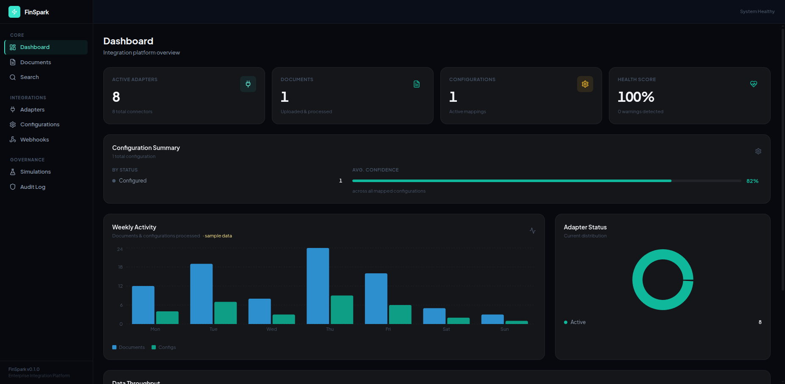
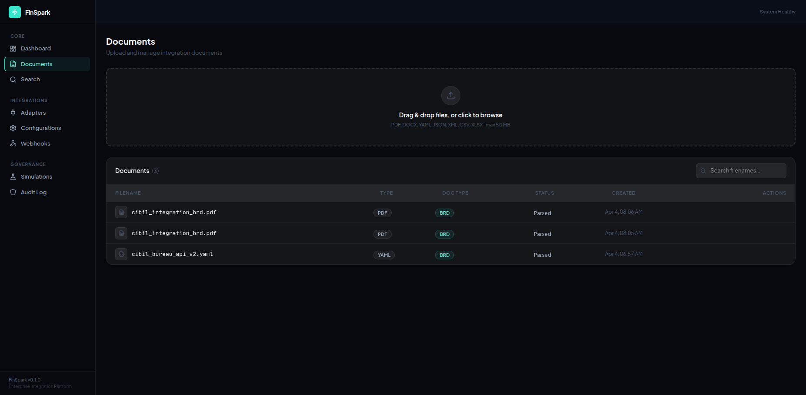
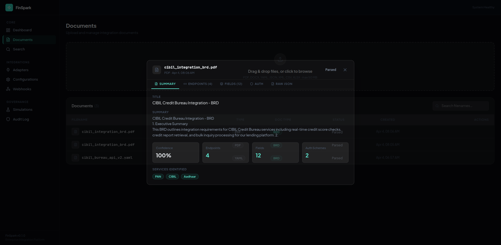
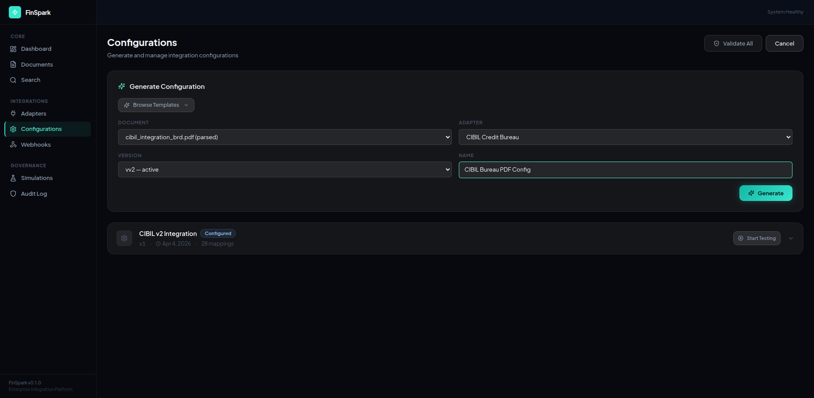
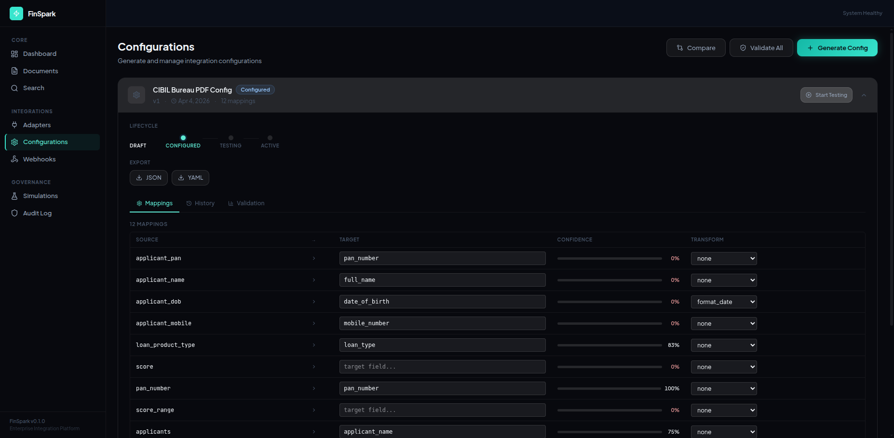
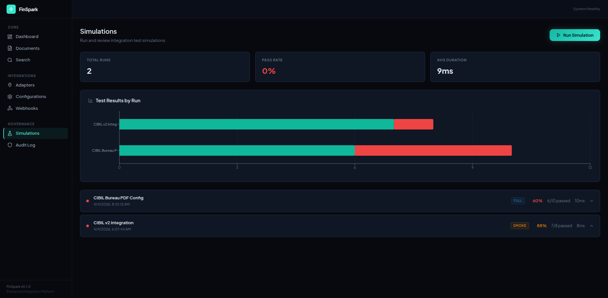
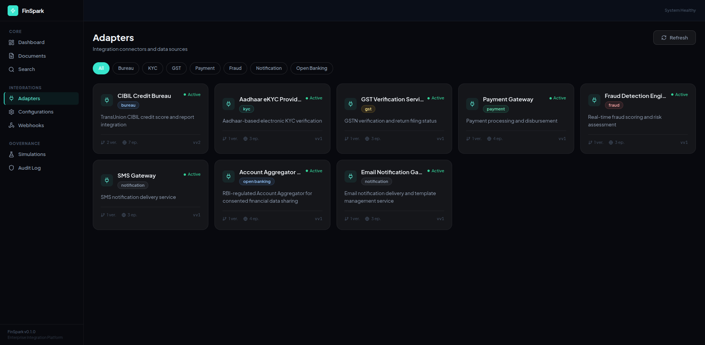
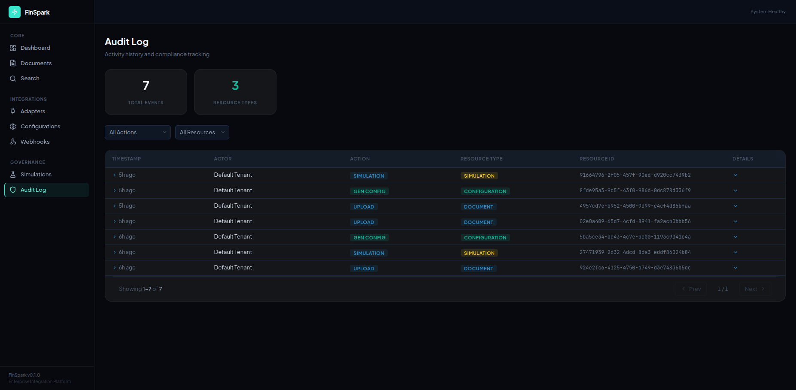

# AdaptConfig

**AI-Powered Integration Configuration Platform for Enterprise Lending**

> Built for **FinSpark Hackathon** | IIT Patna

| | |
|---|---|
| **Live App** | [adaptconfig-frontend-production.up.railway.app](https://adaptconfig-frontend-production.up.railway.app) |
| **API** | [adaptconfig-api-production.up.railway.app](https://adaptconfig-api-production.up.railway.app) |
| **API Docs** | [Swagger UI](https://adaptconfig-api-production.up.railway.app/docs) |

### Team

| Name | Role |
|---|---|
| **Akash Kumar** | Full-Stack Developer, IIT Patna |

---

## What It Does

Indian lending platforms integrate with 8+ external APIs (credit bureaus, KYC, payments, etc.). Each integration requires manual field mapping, auth configuration, and testing — typically taking **2-4 weeks**.

**AdaptConfig automates this entire process:**

```
Upload API Spec → AI Parses Fields → Generate Config → Simulate & Test → Deploy
```

### Live Demo Results

Tested on production with the CIBIL Bureau API v2 specification:

| Step | Result |
|---|---|
| Document parsing | **4 endpoints, 28 fields, 2 auth schemes** extracted at **95% confidence** |
| Config generation | **28/28 fields mapped** at **100% confidence** via Gemini 3 + rule engine |
| Simulation | **8/8 tests PASSED** (structure, mappings, endpoints, auth, hooks) |

---

## Screenshots

### Dashboard
Real-time metrics with glassmorphism design — adapter count, config summary, activity charts.



### Document Upload & Parsing
Drag & drop YAML/PDF/DOCX specs. Parser extracts endpoints, fields, auth schemes automatically.



### Parsed Document Detail
5-tab modal showing extracted data: Summary, Endpoints, Fields (28 with types/required), Auth, Raw JSON.



### AI-Powered Config Generation
Select document + adapter from dropdowns. Gemini 3 generates config, rule engine augments with confidence scores.



### Field Mappings with Confidence
Editable field mapping table with color-coded confidence bars, transform dropdowns, lifecycle stepper.



### Simulation Results
8/8 smoke tests pass — config structure, field mapping coverage, each endpoint, auth, and hooks validated.



### Adapter Catalog
8 pre-built Indian fintech adapters with category filtering and version detail.



### Audit Trail
Immutable audit log with action/resource filters and pagination.



---

## Architecture

```
┌──────────────┐     ┌───────────────────────┐     ┌──────────────┐
│   React 18   │────▶│    FastAPI Backend     │────▶│  PostgreSQL  │
│  TypeScript  │     │   (34 API endpoints)   │     │  (Railway)   │
│  Tailwind    │     │                        │     └──────────────┘
└──────────────┘     │  ┌─────────────────┐   │
                     │  │ Document Parser  │   │     ┌──────────────┐
                     │  │ (PDF/DOCX/YAML) │   │────▶│  Gemini 3    │
                     │  └─────────────────┘   │     │  Flash API   │
                     │  ┌─────────────────┐   │     └──────────────┘
                     │  │ Config Engine    │   │
                     │  │ (AI + Rules)     │   │
                     │  └─────────────────┘   │
                     │  ┌─────────────────┐   │
                     │  │ Simulation       │   │
                     │  │ (8 mock adapters)│   │
                     │  └─────────────────┘   │
                     └────────────────────────┘
```

## Tech Stack

| Layer | Technology |
|---|---|
| **Frontend** | React 18, TypeScript, Tailwind CSS, Recharts |
| **Backend** | FastAPI, SQLAlchemy (async), Pydantic v2 |
| **AI** | Google Gemini 3 Flash (REST API) |
| **Database** | PostgreSQL (Railway) / SQLite (dev) |
| **Deploy** | Railway (Docker), nginx |
| **Testing** | pytest (899 tests), vitest |

## Key Features

- **Document Parsing**: PDF, DOCX, YAML, JSON — extracts endpoints, fields, auth, SLA requirements
- **AI Config Generation**: Gemini 3 generates field mappings, rule engine validates with fuzzy matching
- **8 Pre-built Adapters**: CIBIL, eKYC, GST, Payment, Fraud, SMS, Account Aggregator, Email
- **Simulation Engine**: Mock API responses per adapter, 8-step validation pipeline
- **Configuration Lifecycle**: Draft → Configured → Validating → Testing → Active (with rollback)
- **Multi-tenant**: Tenant isolation, RBAC, immutable audit trail
- **Security**: JWT auth, rate limiting, PII masking, CORS, CSP headers, path traversal protection
- **Search**: Fuzzy search across adapters, configs, simulations

## Quick Start (Local)

```bash
git clone https://github.com/Akasxh/adaptconfig.git
cd adaptconfig

# Backend
cp .env.example .env  # Add your GEMINI_API_KEY
uv sync --frozen
uv run uvicorn finspark.main:app --reload --port 8000

# Frontend (new terminal)
cd frontend && npm ci && npm run dev
```

Open http://localhost:5173

## Test Documents

| File | Complexity | Endpoints | Fields |
|---|---|---|---|
| `test_fixtures/01_simple_kyc_api.yaml` | Simple | 1 | 4 |
| `test_fixtures/02_payment_gateway_api.yaml` | Medium | 4 | 10+ |
| `test_fixtures/cibil_bureau_api_v2.yaml` | Complex | 4 | 28 |
| `test_fixtures/03_account_aggregator_complex.yaml` | Advanced | 4 | 20+ |

## Stats

| Metric | Value |
|---|---|
| API Endpoints | 34 |
| Pre-built Adapters | 8 |
| Tests | 899 |
| Code Coverage | 82% |
| Frontend Pages | 8 |

---

See [HOW_TO_USE.md](HOW_TO_USE.md) for detailed usage instructions.
